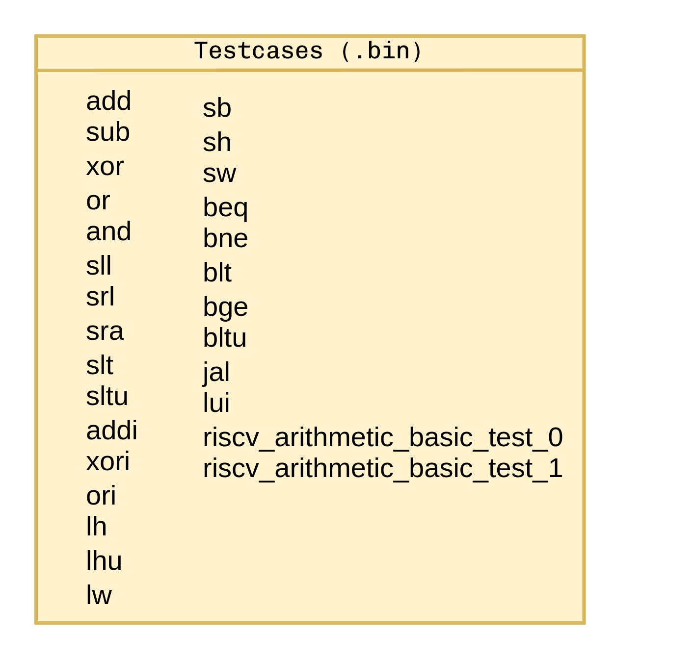

# UVM-Based Testbench for IBEX Core Verification  

## Overview  
This repository contains a Universal Verification Methodology (UVM)-based testbench designed for verifying a IBEX core. The environment ensures modularity, scalability, and robust functionality testing. It features agents, sequencers, monitors, and a unified memory model to validate core operations comprehensively.

---

## Features  
- **Three Interfaces** 
  - `dut_probe_intf`: Monitors core status and controls fetch enable signals. 
  - `instr_mem_intf`: Handles fetch unit signals. 
  - `data_mem_intf`: Manages Load Store Unit (LSU) signals.

- **Unified Memory Model**
  - A memory abstraction serves both instruction and data requests. Program binaries are loaded into this memory for simulation.

- **Structured Verification Components**
  - INSTR_UVC, DATA_UVC, and ENV_UVC enable seamless verification.
---

## Block Diagrams
### Instruction Agent


### Data Agent


### Environment Overview


### Top Module


---

## Testcases  
### Coverage Highlights  
- Arithmetic Instructions: `add`, `sub`, `mul`, etc. 
- Logic Instructions: `and`, `or`, `xor`.
- Load/Store Operations: `lw`, `sw`, `lhu`, `sh`.
- Branching: `beq`, `bne`, `blt`, etc.

### Testcase Legend  
Refer to the diagram below for testcase mapping:


---

## Getting Started  

### Prerequisites  
- Verilog RTL of the IBEX core.
- UVM-compatible simulator (e.g., Synopsys VCS, Mentor Questa).

### Running the Simulation  
1. Clone this repository:
   ```bash
   git clone <repository_url> 
   cd <repository_name>
   ```
2. Compile the testbench:
   ```bash 
   make tb-compile
   ```
3. Simulate a program:
   ```bash 
   make sim +bin=path-to-binary-file
   ```

---

## Contribution  
Contributions are welcome! Please fork the repository and create a pull request for any suggestions or improvements.
